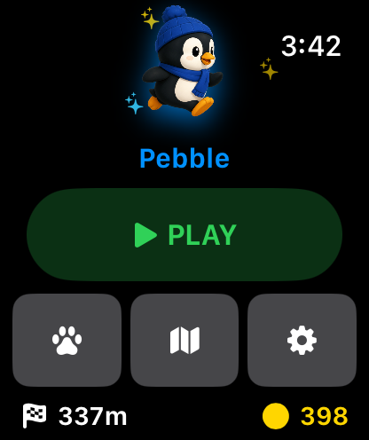
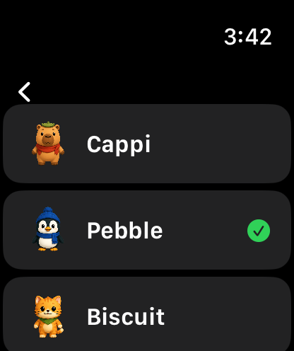
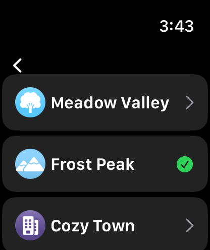
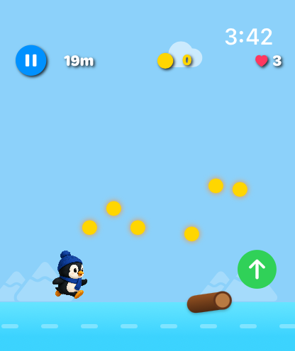

# ZOOMIES

## Stack

- Swift
- SwiftUI
- watchOS
- Xcode
- SF Symbols
- Asset catalogs

## Folder Structure

```text
.
├── ZOOMIES.xcodeproj
├── ZOOMIES Watch App
│   ├── Assets.xcassets
│   ├── GameEngine.swift
│   ├── GameView.swift
│   ├── HomeView.swift
│   ├── CharacterSelectView.swift
│   ├── MapSelectView.swift
│   ├── SettingsView.swift
│   └── supporting models and managers
├── assets
│   ├── characters
│   ├── logos
│   └── preview
│       ├── home.png
│       ├── characters.png
│       ├── map-menu.png
│       └── game-play.png
```

## Game Logic

ZOOMIES is an Apple Watch endless runner. The player stays fixed while the world scrolls from right to left. Obstacles, coins, and map scenery move across the screen as distance increases.

The game tracks jump state, collisions, lives, coins, distance, selected character, selected map, settings, and best scores. Characters can run on any map. Obstacles are capped and spaced out so the playfield stays readable on the watch screen.

## Pics









## License

No license has been specified yet.

## Features

- Apple Watch endless-runner gameplay
- Five playable characters: Cappi, Pebble, Biscuit, Boba, and Momo
- Five maps: Meadow Valley, Frost Peak, Cozy Town, Sunny Beach, and Jungle Canopy
- Character sprite poses for idle, running, and jumping
- Jumping, obstacle avoidance, coin collection, lives, and game-over state
- Standard mode and YOLO mode
- Screen-button and Digital Crown control options
- Sound, haptics, distance units, and persistent score settings
